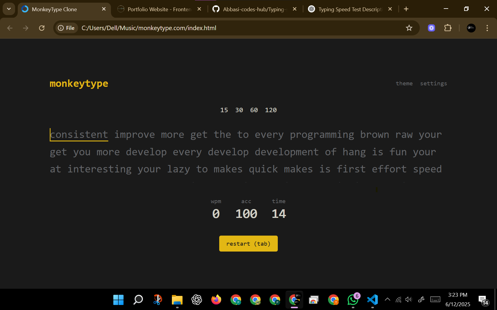
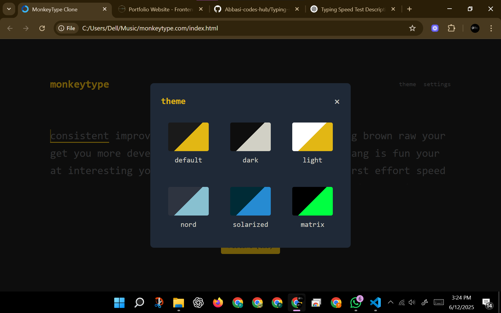
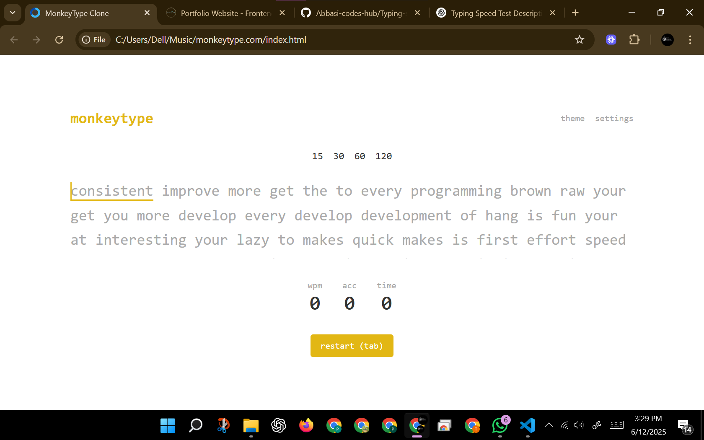

# Typing-speed-test-new-logicic
This project is an advanced typing speed test app featuring optimized logic for accurate WPM calculation and user performance tracking. It includes multiple modern themes for a personalized UI experience. Built for speed, precision, and sleek design — perfect for developers, students, and typists looking to challenge their skills.

# 🚀 Typing Speed Test – New Logic

A modern typing speed test application that introduces a unique logic: instead of typing entire paragraphs, **one word is selected from each sentence** — keeping your **mind focused and alert** throughout the test. With **multiple elegant themes** and a clean UI, this app offers a refreshing way to boost your typing and mental agility.

## 🧠 Unique Logic

Unlike traditional typing tests, this app:
- Displays a **full paragraph** for context.
- Extracts **one key word** from each sentence that the user must type.
- Trains the brain to **stay sharp, focused, and mentally engaged**.
- Ideal for developers, typists, and productivity enthusiasts.

## 🎨 Themes

Choose from multiple visually appealing themes:
- 🌙 Dark Mode
- ☀️ Light Mode
- 🌈 Gradient Themes
- 🎯 Focus Mode

Themes can be switched live, enhancing both usability and personal preference.

## 📸 Screenshots

| Home Screen | Typing Interface | Theme Selection |
|-------------|------------------|------------------|
|  |  |  |

> ⚠️ Make sure to place your screenshots inside the `/screenshots/` folder with proper names as shown above.

## 🛠️ Features

- ⚡ Real-time typing accuracy and WPM tracking
- 🧠 Brain-focused paragraph-to-word test logic
- 🎨 Multiple theme support
- 📱 Fully responsive design
- 📊 Results summary with performance breakdown

## 📁 Installation

```bash
git clone git@github.com:Abbasi-codes-hub/Typing-speed-test-new-logicic.git
cd Typing-speed-test-new-logicic
open index.html
